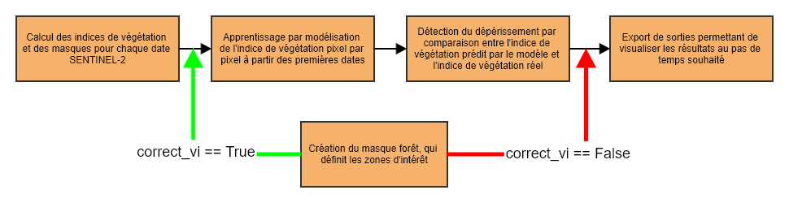
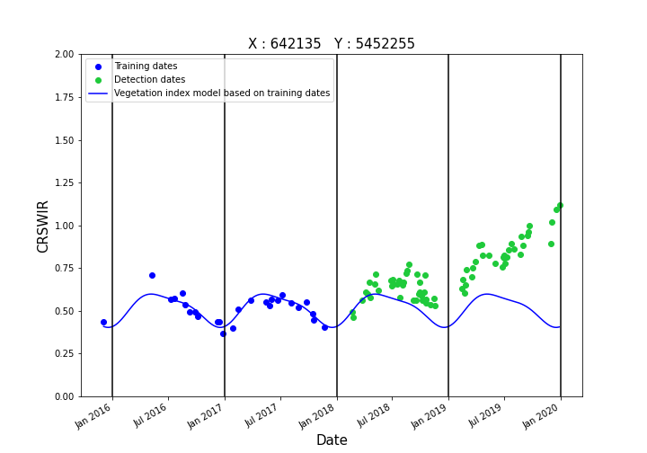

## Fordead {#fordead}


```{r include=FALSE}
knitr::opts_chunk$set(echo = TRUE, fig.align = "center")
# lectura de librerías ----------------------------------------------------
library(rHarmonics)
library(ggplot2)
library(dplyr)
library(readr)
library(lubridate)
library(plotly)
require(knitr)
require(kableExtra)
library(DT)

```

**[fordead](https://fordead.gitlab.io/fordead_package/): A python package for vegetation anomalies detection from SENTINEL-2 images**

### Antecedentes


El paquete `fordead`, desarrollado para la detección de anomalías en la vegetación a partir de las series temporales de SENTINEL-2, proporciona herramientas de seguimiento para hacer frente a la crisis sanitaria de los escarabajos de la corteza en los abetos de Francia. Incluye varias herramientas que facilitan el uso de los datos del satélite SENTINEL-2 y permiten la detección potencial de anomalías en otros contextos. El método propuesto aprovecha las series temporales completas de SENTINEL-2, desde el lanzamiento del primer satélite en 2015. Detecta las anomalías a nivel de píxel para analizar los datos de archivo o para llevar a cabo un seguimiento continuo. Las detecciones se actualizan luego para cada nueva adquisición de SENTINEL-2.


La detección se realiza en cinco o seis pasos.

1. El cálculo de los índices de vegetación y las máscaras para cada fecha de SENTINEL-2
2. El entrenamiento mediante la modelización del índice de vegetación píxel a píxel de las primeras fechas
3. La detección de anomalías comparando el índice de vegetación previsto por el modelo con el índice de vegetación real
4. La creación de una máscara forestal, que define las áreas de interés
5. La exportación de los resultados como shapefiles que permiten visualizar los resultados con el paso de tiempo deseado

> N.B. Es posible corregir el índice de vegetación utilizando un factor de corrección calculado a partir de la mediana del índice de vegetación de los rodales de interés a gran escala, en cuyo caso la etapa de creación de la máscara debe realizarse antes de la etapa de entrenamiento del modelo.


```{r diagrama-fordedad, echo=FALSE, out.width="100%", fig.align='center', fig.cap="Diagrama de procesos de fordead"}


```


El primero de ellos grafica la serie temporal del índice de vegetación para un píxel concreto, junto con el modelo asociado, el umbral de detección de anomalías y la detección asociada.


```{r anomalias-fordedad, echo=FALSE, out.width="50%", fig.align='center', fig.show='hold',  fig.cap=c("Vetación saludable", "Vegetación intervenida")}
knitr::include_graphics(c("images/graph_healthy.png", "images/graph_dieback.png"))

```


**Etapa 2 : Definición de la estacionalidad en función de los píxeles a partir de un modelo armónico**


Para cada píxel se ajusta un modelo armónico basado en un periodo de tiempo definido por el usuario, considerado como representativo de un comportamiento estacional "normal" del índice de vegetación. La parametrización del modelo está influida por muchos factores, como la densidad del bosque, la composición y la topografía. Dado que esta estacionalidad es relativamente variable entre los píxeles, incluso dentro de un rodal forestal individual, la estacionalidad se establece a nivel de píxel para tener en cuenta estas diferencias. 


```{r CRSWIR-plot, echo=FALSE, out.width="100%", fig.align='center', fig.cap="Serie de valor de pixel CRSWIR"}


```

La siguiente figura ilustra una serie temporal correspondiente a CRSWIR \@ref(eq:CRSWIR) para un solo píxel basada en adquisiciones de Sentinel-2 sin enmascarar, y el correspondiente modelo periódico ajustado a partir de adquisiciones que cubren el periodo de entrenamiento:


Definición de CRSWIR 

\begin{equation}

  SWIR_{cr}=\frac{SWIR_1}{(NIR_a+(\lambda_{SWIR_1}-\lambda_{NIR_a})*(\frac{SWIR_2-NIR_a}{\lambda_{SWIR_2}-\lambda{NIR_a}}))}(\#eq:CRSWIR)

\end{equation}

Donde:  

- $\lambda_{NIR_a}$ = 865 
- $\lambda_{SWIR_1}$ = 1610 
- $\lambda_{SWIR_2}$ = 2190


Notar que _CR_ es el acrónimo de "continuum removal", una técnica que maximiza el contraste espectral asociado a los picos de absorción normalizando el valor de la reflectancia con respecto al valor de una "envolvente convexa" calculada a partir de las bandas espectrales vecinas.


El modelo periódico ajustado a lo largo del periodo de entrenamiento se expresa de la siguiente manera:


\begin{equation}

  a_1+b_1 \sin\frac{2\pi t}{T}+b_2 \cos \frac{2\pi t}{T}+b_3 \sin\frac{4\pi t}{T}+b_4 \cos\frac{4\pi t}{T} (\#eq:model-fordead)

\end{equation}


La ecuación \@ref(eq:model-fordead) se utiliza para modelar las variaciones estacionales de CRSWIR para una masa arbórea de especias sana. La constante $T$ es igual a 365,25. Esta ecuación ajustada a 300 parcelas de abeto sanos. Para un píxel dado, el estudio de la serie temporal de valores CRSWIR \@ref(eq:CRSWIR), correspondiente a cada fecha para la que se dispone de una imagen Sentinel-2, permite determinar si la parcela está sometido a estrés. Hay varias situaciones además de un rodal de abeto sano y un rodal de abeto descortezado. También es necesario determinar si el rodal está cortado (detección de suelo desnudo), o si el bosque está bajo estrés temporal debido probablemente a un déficit hídrico temporal. Los bosques de abetos en suelos con régimen hídrico alternante son fuertemente representativos de esta última situación, con lo que típicamente un déficit hídrico estival conduce un estrés temporal que se manifestará como un aumento de CRSWIR, pero que se diferencia de un ataque de escarabajos de la corteza por un retorno a un estado de salud normal (disminución de CRSWIR) poco después. 
[https://forestimator.gembloux.ulg.ac.be/pdf/methodoAnalyseSentinel2TimeSerie2021.pdf](https://forestimator.gembloux.ulg.ac.be/pdf/methodoAnalyseSentinel2TimeSerie2021.pdf)

### Experimentación


Modelo: [gitlab](https://gitlab.com/fordead/fordead_package/-/blob/master/fordead/model_vegetation_index.py)

