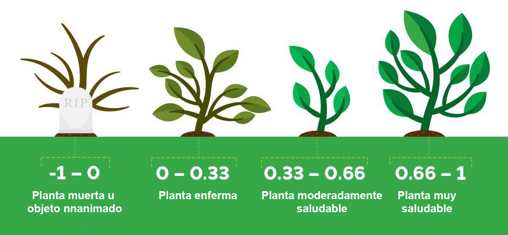

# Marco Teórico {#m_teorico}
  


## Modelos Armónicos

### Quantifying the Response of German Forests to Drought Events via Satellite Imagery [@philipp_quantifying_2021]


**Resumen**: Los sistemas forestales desempeñan funciones ecosistémicas cruciales para nuestro entorno, como el equilibrio de las reservas de carbono y la influencia en el clima local, regional y mundial. La tendencia al aumento de la frecuencia de los fenómenos meteorológicos extremos inducidos por el cambio climático, incluida la sequía, supone un gran reto para la gestión forestal. En este contexto, la aplicación de los datos de teledetección proporciona un poderoso medio para realizar investigaciones rápidas, operativas y baratas a grandes escalas espaciales y temporales. Este estudio se dedicó a explorar el potencial de los datos de satélite en combinación con los **análisis armónicos** para cuantificar la respuesta de la vegetación a los eventos de sequía en los bosques alemanes. El método de modelización armónica se comparó con un enfoque de estandarización z-score y se correlacionó con datos meteorológicos y topográficos. Se utilizaron imágenes ópticas de satélite de Landsat y del espectrorradiómetro de imágenes de resolución moderada (MODIS) en combinación con tres índices de vegetación comúnmente aplicados. Las puntuaciones de correlación más altas basadas en la técnica de modelización armónica se **calcularon para el 6º grado armónico**. Las imágenes MODIS en combinación con el Índice de Vegetación de Diferencia Normalizada (NDVI) generaron los mejores resultados para medir la respuesta espectral a las condiciones de sequía. La mayor correlación entre los datos de teledetección y las medidas meteorológicas se observó en el caso de la humedad del suelo y el Índice de Severidad de la Sequía de Palmer autocalibrado (scPDSI). Además, se identificó que las regiones forestales sobre suelos arenosos con pinos como tipo de árbol dominante eran especialmente vulnerables a la sequía. Además, los análisis topográficos sugirieron que los efectos de la sequía estaban mitigados a lo largo de las laderas de las colinas. Si bien los enfoques propuestos proporcionan información valiosa sobre la dinámica de la vegetación como respuesta a las condiciones meteorológicas, se requieren mediciones in situ estandarizadas en escalas espaciales mayores y relacionadas con la cuantificación de la sequía para una evaluación de calidad más profunda de los métodos y datos utilizados.


## Definición de Conceptos

### NDVI

por completar....

\begin{equation}

  NDVI=\frac{NIR-RED}{NIR+RED}(\#eq:ndvi)

\end{equation}

```{r, echo=FALSE, out.width="50%", fig.align='center', fig.cap="Descripción de valores NDVI"}



```


### Forcasting de series temporales

El Forcasting de series temporales es el método de exploración y análisis de los datos de series temporales registrados o recogidos durante un periodo de tiempo determinado. Esta técnica se utiliza para pronosticar valores y realizar predicciones futuras. No todos los datos que tienen como características valores de tiempo o de fecha pueden considerarse datos de series temporales. Cualquier dato apto para la previsión de series temporales debe consistir en observaciones a lo largo de un intervalo regular y continuo.


### Componentes de las series temporales

Para utilizar datos de series temporales y desarrollar un modelo, es necesario comprender los patrones de los datos a lo largo del tiempo. Estos patrones se clasifican en cuatro componentes, que son

#### Tendencia

Representa el cambio gradual de los datos de la serie temporal. El patrón de tendencia representa el crecimiento o la disminución a largo plazo.

#### Nivel

Se refiere a los valores de referencia de los datos de la serie si fuera una línea recta.

#### Estacionalidad

Representa los patrones a corto plazo que se producen en una sola unidad de tiempo y se repiten indefinidamente.

#### Ruido

Representa las variaciones irregulares y es puramente aleatorio. Estas fluctuaciones son imprevistas, imprevisibles y no pueden ser explicadas por el modelo.

### Métodos de previsión de series temporales


#### Modelo ARIMA

ARIMA significa Media Móvil Integrada Autorregresiva. Es una combinación del modelo autorregresivo (AR) y de la media móvil (MR). La previsión del modelo AR corresponde a una combinación lineal de valores pasados de la variable. La previsión del modelo de media móvil corresponde a una combinación lineal de los errores de previsión pasados. La "I" representa los valores de los datos que se sustituyen por la diferencia entre sus valores y los valores anteriores.

#### Modelo SARIMA

SARIMA son las siglas de Seasonal Autoregressive Integrated Moving Average. Amplía el modelo ARIMA añadiendo una combinación lineal de valores pasados estacionales y errores de previsión.

#### VAR

El método de autorregresión vectorial (VAR) modela el siguiente paso de cada serie temporal utilizando un modelo AR. El modelo VAR es útil cuando se desea predecir múltiples variables de series temporales mediante un único modelo.

#### LSTM

La red de memoria a largo plazo o LSTM es un tipo especial de red neuronal recurrente que se ocupa de las dependencias a largo plazo. Puede recordar información de datos pasados y es capaz de aprender la dependencia del orden en problemas de predicción de secuencias.

