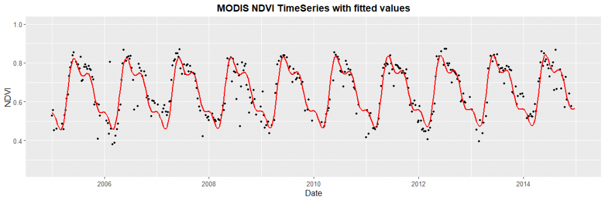

## rHarmonics {#rHarmonics}


```{r setup, include=FALSE}
knitr::opts_chunk$set(echo = TRUE, fig.align = "center")
# lectura de librerías ----------------------------------------------------
library(rHarmonics)
library(ggplot2)
library(dplyr)
library(readr)
library(lubridate)
library(plotly)
require(knitr)
require(kableExtra)
library(DT)


```

### Antecedentes

**Definición de la estacionalidad por píxeles basada en un modelo armónico** 

Para cada píxel se ajusta un modelo armónico basado en un periodo de tiempo, considerado como representativo de un comportamiento estacional "normal" del índice de vegetación para el caso estudiado. 

Para calcular la curva armónica ajustada de una señal periódica, se calculan regresiones por mínimos cuadrados ordinarios utilizando curvas de seno y coseno acopladas sobre datos de series temporales. El algoritmo subyacente que se basa en la siguiente ecuación [@shumway_spectral_2017]

<!-- $$a_1+b_1 \sin\frac{2\pi t}{T}+b_2 \cos \frac{2\pi t}{T}+b_3 \sin\frac{4\pi t}{T}+b_4 \cos\frac{4\pi t}{T}$$ -->
\begin{equation}
  X_t=\beta_0+\beta_1\cdot2\pi t + \sum_{i=1}^{n}(\beta_{2i}\cdot\cos(\frac{i2\pi t}{T})\cdot \beta_{3i}\cdot\sin(\frac{i2\pi t}{T}))
  (\#eq:harmonic-shumway)
\end{equation}


Donde:

- $t$ = Diferencia de tiempo en años fractales desde el 1 de enero de 1970
- $T$ = Duración del periodo de tiempo (un año)
- $n$ = Número total de armónicos
- $i$ = armónicos actuales
- $\beta_x$ = Coeficientes independientes derivados de la regresión OLS


```{r harmonic-plot, echo=FALSE, out.width="100%", fig.align='center', fig.cap="MODIS NDVI time-series data together with a harmonic fitted curve using 3 cylces per year."}


```


### Experimentación: R package for harmonic modelling of time-series data

Para la siguiente experimentación se tomo en cuenta la siguiente trabajo como referencia, que es el caso de ejemplo de uso de la librería [@noauthor_r_2020]

**Lectura de Datos**

Para este ejemplo se utilizará la base de datos de los registros de NDVI, que fueron abordados en capítulo de [Exploración de Datos ] \@ref(explo). En específico se usarán los datos correspodientes a `disturbed` (intervenidos) que fueron interpolados.


```{r }
# Lectura de Insumos ------------------------------------------------------
disturbed_int <- read.csv2("data/csv/disturbed_i_df.csv", sep = ",",check.names=F) %>%
  select(date:ncol(.)) %>%
  mutate(date = as.Date(date))


```
```{r tab-disturbed, echo=FALSE}
  kable_styling(
  kable(disturbed_int %>% head(10),
        digits = 3, row.names = FALSE, align = "c",
        caption = "Primeros 10 registros de Base 'distubed'"),
        bootstrap_options = c("striped", "hover", "condensed"),
        position = "center", full_width = TRUE,  font_size = 14) 


```

Los datos de la columna `ndvi_interpolated` seràn los que se utilizarán para la prueba. La tabla filtrada tiene la siguiente dimensión `r dim(disturbed_int)`

**Selección de una Serie**

```{r}
ndvi_df <- disturbed_int %>% filter(serie == "f_015") %>%
  select(date, ndvi = ndvi_interpolated) %>%
  mutate(ndvi = as.numeric(ndvi))
```

::: {#nota .greeting .message style="color: #999999;"}
* Confirmar si los valores correponden valores aleatorios de una parcela o el promedio de un área de estudio.

* Solicitar información que tipo de área de estudio, y coordendaes para tener mayor referencia espacial.
:::

**Aplicación Función `harmonics_fun()`**

```{r}
# Apply harmonic function using 1 cycles per year
fitted_3rd_deg <- harmonics_fun(user_vals = ndvi_df$ndvi,
                                user_dates = ndvi_df$date,
                                harmonic_deg = 1)

fitted_3rd_deg %>% head(10)
```

La función anterior, genera un vector con los datos ajustado por función armónica, de largo igual a la cantidad de registros de la serie (`r fitted_3rd_deg %>% length`)


**Consolidar una Tabla**

```{r}
# Combine fitted values with original df
combined_df <- cbind(ndvi_df, fitted_3rd_deg)
names(combined_df) <- c("dates", "ndvi", "fitted")
```


**Visualización de Resultados**

```{r}
p <- ggplot2::ggplot() +
  geom_point(data=combined_df, aes(x = dates, y = ndvi), color='gray50', size=1) +
  geom_line(data=combined_df, aes(x = dates, y = fitted), colour = "orange", size=1)+
  labs(title="NDVI TimeSeries with fitted values", x="Date", y="NDVI") +
  theme(plot.title = element_text(hjust = 0.5, face="bold", size=14),
        axis.text=element_text(size=10),
        axis.title=element_text(size=12),
        legend.title=element_text(size=13, face="bold"),
        legend.text=element_text(size=13))+
  ylim(0,1)+
  theme_bw()


ggplotly(p)

```

**Conclusiones**

Como se observaen la visualización anterior  la modelo armónico no se ajusta a los datos, por lo cual se tiene que investigar para encontrar los parámetros del modelo que permitan que los valores predichos por modelo se austen a los datos reales. Se puede probar eliminando los valores outliers o interpolarlos.


